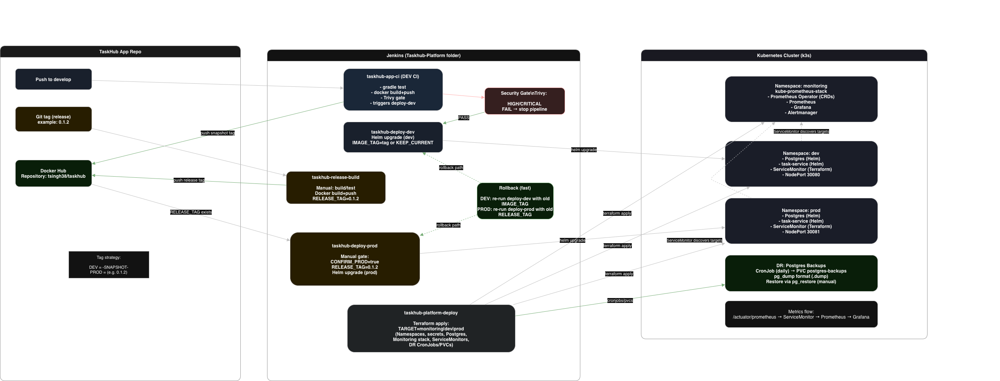
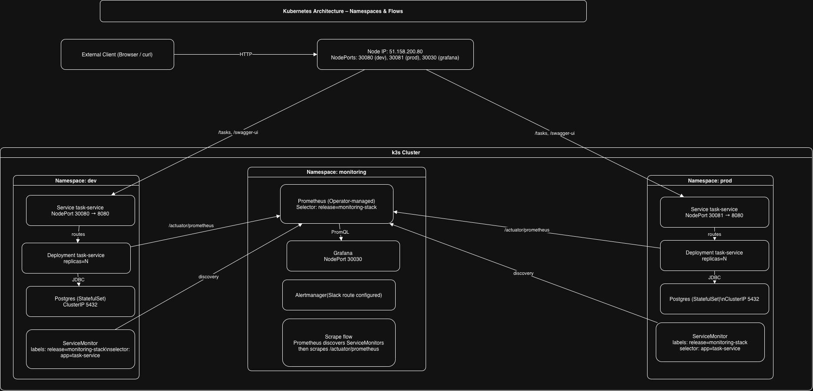

# TaskHub Platform Infra

## Overview
This repository contains the **Kubernetes platform + deployments** for TaskHub:

- Terraform provisioning (**namespaces, secrets, Postgres, monitoring stack, ServiceMonitor resources**)
- Helm-based **app deployments** to **DEV/PROD**
- Jenkins pipelines (**pipeline-as-code**)

---

## Architecture

### 1) Jenkins pipeline architecture

The platform is operated via Jenkins jobs with clear separation of responsibilities:

- **App CI (`taskhub-app-ci`)** builds/tests the application, publishes the Docker image, runs a Trivy scan gate, then triggers **DEV deploy** using the produced image tag.
- **Release build (`taskhub-release-build`)** is **manual** and builds/tests/pushes a **versioned Docker tag** (e.g., `0.1.2`) for PROD deployments.
- **Infra jobs (this repo)** deploy the application (Helm) and provision platform resources (Terraform).




### 2) Kubernetes architecture (3 namespaces)

The cluster is organized into three namespaces:

- **monitoring**
    - `kube-prometheus-stack` via Helm: Prometheus Operator, Prometheus, Grafana, Alertmanager, exporters
- **dev**
    - Postgres (Helm release)
    - TaskHub `task-service` (Helm release)
    - NodePort access: **30080**
    - ServiceMonitor (CR) selecting the `task-service` Service for scraping
- **prod**
    - Postgres (Helm release)
    - TaskHub `task-service` (Helm release)
    - NodePort access: **30081**
    - ServiceMonitor (CR) selecting the `task-service` Service for scraping

Runtime request flow:
- Client → NodePort → Kubernetes Service → task-service Pod → Postgres Service → Postgres Pod

Metrics flow:
- task-service `/actuator/prometheus` → Prometheus (via ServiceMonitor) → Grafana dashboard




---

## Jenkins jobs (server)

All jobs are in Jenkins folder: **Taskhub-Platform**

| Job | Trigger | What it does |
|---|---|---|
| `taskhub-app-ci` | push to `develop` | Build + test + Docker build/push + Trivy gate, then triggers `taskhub-deploy-dev` with the produced image tag |
| `taskhub-release-build` | manual (tag-driven) | Builds + tests + Docker build/push for a **release tag** (e.g. `0.1.2`) so the tag exists in Docker Hub |
| `taskhub-deploy-dev` | automated or manual | Helm deploy/upgrade `task-service` in `dev` |
| `taskhub-deploy-prod` | manual only | Helm deploy/upgrade `task-service` in `prod` (explicit confirmation + release tag) |
| `taskhub-platform-deploy` | manual | Terraform apply for `monitoring`, `dev`, or `prod` |

---

## Platform provisioning (Terraform)

### Job: `taskhub-platform-deploy`
Parameters:
- `CONFIRM_APPLY=true`
- `TARGET=monitoring|dev|prod`

Recommended order on a fresh cluster:
1. `TARGET=monitoring` (installs Prometheus Operator + CRDs)
2. `TARGET=dev`
3. `TARGET=prod`

Why order matters:
- **ServiceMonitor** is a CRD provided by **Prometheus Operator**. If monitoring isn’t installed first, ServiceMonitor apply will fail.

What Terraform manages:
- Namespaces: `monitoring`, `dev`, `prod`
- Kubernetes secrets (DB creds, Slack webhook secret used by Alertmanager)
- Postgres Helm release per namespace
- Monitoring stack Helm release (`kube-prometheus-stack`)
- ServiceMonitor resources (so Prometheus discovers `/actuator/prometheus` endpoints)

---

## Application deployments (Helm)

### DEV deploy: `taskhub-deploy-dev`
Parameter:
- `IMAGE_TAG`
    - real tag → deploy that image
    - `KEEP_CURRENT` → reuse current running tag and apply only values changes (e.g., replicas)

Helm inputs:
- Chart: `infra/helm/charts/task-service`
- Values: `infra/helm/values/task-service/values-dev.yaml`

### PROD deploy: `taskhub-deploy-prod`
Parameters:
- `CONFIRM_PROD=true`
- `RELEASE_TAG=<docker-tag>`
- Prerequisite: the Docker image tag must already exist in Docker Hub (typically created by `taskhub-release-build`).

Helm inputs:
- Chart: `infra/helm/charts/task-service`
- Values: `infra/helm/values/task-service/values-prod.yaml`

---

## Monitoring

### Stack
Deployed into namespace `monitoring` using `kube-prometheus-stack`.

### How app metrics are scraped
1. App exposes metrics at `/actuator/prometheus`
2. A **ServiceMonitor** selects the `task-service` Kubernetes Service via labels
3. Prometheus Operator converts ServiceMonitor into Prometheus scrape targets

Important selector:
- Prometheus is configured with:
    - `serviceMonitorSelector.matchLabels.release=monitoring-stack`
- Therefore every TaskHub ServiceMonitor must include:
    - `metadata.labels.release: monitoring-stack`

ServiceMonitor manifests:
- `infra/monitoring/servicemonitors/task-service-dev.yaml`
- `infra/monitoring/servicemonitors/task-service-prod.yaml`

---

## Access (NodePorts)

| Component | URL |
|---|---|
| DEV task-service | http://51.158.200.80:30080/ |
| PROD task-service | http://51.158.200.80:30081/ |
| Grafana | http://51.158.200.80:30030/ |
| Jenkins | http://51.158.200.80:8080/ |

---

## Fresh install checklist (high-level)
1. Install prerequisites on VM: k3s/kubectl, helm, terraform, docker (as required), Jenkins
2. Run `taskhub-platform-deploy` with `TARGET=monitoring`
3. Run `taskhub-platform-deploy` with `TARGET=dev`
4. Run `taskhub-platform-deploy` with `TARGET=prod`
5. App deployments:
    - DEV: via `taskhub-app-ci` (auto) or `taskhub-deploy-dev` (manual)
    - PROD: manual via `taskhub-deploy-prod` with a valid Docker tag

---

## Disaster Recovery (DR)

This project includes a **minimal, demoable** DR story covering:
1) **Database backups** (scheduled)
2) **Database restore** (manual procedure)
3) **Rollback** of a bad application release/config
4) **Reprovision** of platform resources via IaC

### 1) Postgres backups (scheduled CronJob)

A Kubernetes **CronJob** runs in each namespace (`dev` / `prod`) and performs a logical backup using `pg_dump`.

What it creates:
- **PVC**: `postgres-backups` (stores dump files)
- **CronJob**: `postgres-backup`
- Backup file format: `taskdb_<timestamp>.dump`

How to verify:

```bash
# DEV
kubectl -n dev  get pvc postgres-backups
kubectl -n dev  get cronjob postgres-backup
kubectl -n dev  get jobs --sort-by=.metadata.creationTimestamp | tail

# PROD
kubectl -n prod get pvc postgres-backups
kubectl -n prod get cronjob postgres-backup
kubectl -n prod get jobs --sort-by=.metadata.creationTimestamp | tail
```

Trigger an on-demand backup:

```bash
kubectl -n dev  create job --from=cronjob/postgres-backup postgres-backup-manual-$(date +%s)
kubectl -n prod create job --from=cronjob/postgres-backup postgres-backup-manual-$(date +%s)
```

> Notes:
> - `pg_dump` produces a consistent logical backup.
> - Dumps are stored on the backup PVC to survive pod restarts.

### 2) Restore procedure (manual)

Restore loads a selected dump file back into Postgres using `pg_restore`.

1. **Pick a dump file** from the backup PVC (created by the CronJob).
2. **Run a one-off restore pod** (mounts `postgres-backups` PVC) and execute `pg_restore`.
3. **Verify** using a simple query.

Example (DEV):
```bash
# Start a restore pod with the backups PVC mounted
kubectl -n dev run pg-restore --rm -it --restart=Never \
  --image=bitnamilegacy/postgresql:16.4.0-debian-12-r0 \
  --overrides='{"spec":{"volumes":[{"name":"backups","persistentVolumeClaim":{"claimName":"postgres-backups"}}],"containers":[{"name":"pg","image":"bitnamilegacy/postgresql:16.4.0-debian-12-r0","command":["bash","-lc"],"args":["ls -lah /backups && echo '---' && pg_restore -Fc -d taskdb /backups/<YOUR_DUMP_FILE>.dump"],"env":[{"name":"PGHOST","value":"postgres-postgresql.dev.svc.cluster.local"},{"name":"PGPORT","value":"5432"},{"name":"PGDATABASE","value":"taskdb"},{"name":"PGUSER","valueFrom":{"secretKeyRef":{"name":"db-credentials","key":"username"}}},{"name":"PGPASSWORD","valueFrom":{"secretKeyRef":{"name":"db-credentials","key":"password"}}}],"volumeMounts":[{"name":"backups","mountPath":"/backups"}]}],"restartPolicy":"Never"}}'

# Verify (example)
kubectl -n dev exec -it postgres-postgresql-0 -- psql -U "$POSTGRES_USER" -d taskdb -c "SELECT count(*) FROM tasks;" || true
```

> Same steps apply for PROD by switching `-n prod` and using `postgres-postgresql.prod.svc.cluster.local`.

### 3) Rollback a bad application release

**DEV rollback**
- Re-run `taskhub-deploy-dev` with:
  - a known-good `IMAGE_TAG`

**PROD rollback**
- Re-run `taskhub-deploy-prod` with:
  - `CONFIRM_PROD=true`
  - `RELEASE_TAG=<previous known-good docker tag>`
- Optional (CLI): `helm -n prod rollback task-service <REVISION>`

### 4) Reprovision platform resources (IaC)

If the cluster/node is rebuilt or namespaces/resources are lost:
1. Ensure prerequisites exist (k3s/kubectl, helm, terraform, Jenkins)
2. Re-run `taskhub-platform-deploy` in order:
   - `TARGET=monitoring`, then `dev`, then `prod`
3. Redeploy the application:
   - DEV auto via CI
   - PROD manual via `taskhub-deploy-prod`
